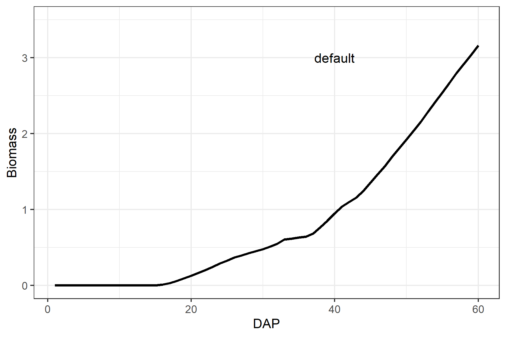
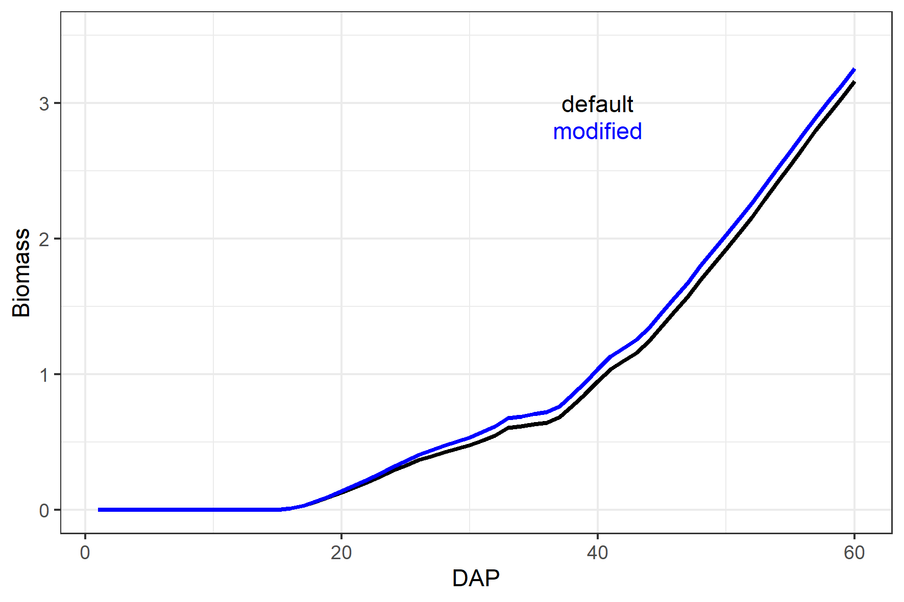

<!-- README.md is generated from README.Rmd. Please edit that file -->

```{r setup, include = FALSE}
knitr::opts_chunk$set(
  collapse = TRUE,
  comment = "#>",
  fig.path = "man/figures/README-",
  out.width = "100%",
  root.dir = "C:/Users/tdeswaef/AquaCrop_70/"
)
knitr::opts_knit$set(root.dir = "C:/Users/tdeswaef/AquaCrop_70/")
#setwd("C:/Users/tdeswaef/AquaCrop_70/")
# getwd()
```

# AquaCropR

<!-- badges: start -->

<!-- badges: end -->

The goal of AquaCropR is to make AquaCrop simulations from within `R` as easy as possible. The package has currently been tested with the AquaCrop standalone version 7.0 on Windows. The most recent version can be downloaded from the [FAO website](https://www.fao.org/aquacrop/software/aquacropplug-inprogramme/en/#c518670).

## Installation and setup

You can install the development version of `AquaCropR` using the `devtools` package:

``` r
library(devtools)
devtools::install_git(url = "https://gitlab.ilvo.be/plant-modelling/aquacropr.git", force = TRUE)
```

The installation of the AquaCrop standalone version is required.

## Example

This is a basic example to run AquaCrop from `R` for the spinach crop.

Importantly, the working directory should be set to the folder in which the *aquacrop.exe* file is located.

```r 
library(AquaCropR)
library(tidyverse)
setwd(dir = path_to_aquacrop_folder)
```

With the package comes an example list with default crop parameters for **quinoa** and **spinach**. To make this list for your own crop, you need an AquaCrop cropfile (*YourCrop.CRO*) whose path should be input in the `read_CRO()` function:

``` r
yourcrop <- read_CRO("path/YourCrop.CRO")` 
```

Once you have the list with default crop parameter values, you can design the scenario's for which you want to run AquaCrop. The `AquaCropR` package provides a function to design the scenario's: `design_scenario()`. The arguments in this function have the following meaning:

-   `name` is a character vector of names for the scenario's.
-   `Plant_Date` is a Date vector that defines the planting date in each scenario  
-   `IRRI` is a character vector of the names of the irrigation scenario's present in the `ID` column of the `IRRI_s` tibble.  
-   `Soil` is a character vector of the names of the soils present in the `ID` column of the `SOL_s` tibble. 
- `Plu`, `Tnx`, and `ETo` are character (vectors) that refer to the names of `R` objects, that hold the daily data for precipitation, temperature and reference evapotranspiration, respectively. 

**IMPORTANT**: 

- The Scenario_s tibble **must** be named `Scenario_s` and **must** have the columns (variables) `Scenario`, `Plant_Date`, `IRRI`, `Soil` and `Meteo`.  
- The irrigation tibble **must** be named `IRRI_s` and **must** have the columns `ID`, `Timing`, `Depth` and `ECw`. Values of the `ID` column are given as input to the `IRRI` argument in the `design_scenario()` function.  
- The soil tibble **must** be named `SOL_s` and **must** have the columns `ID`, `Horizon`, `Thickness`, `SAT`, `FC`, `WP`, `Ksat`, `Penetrability` and `Gravel`. Values of the `ID` column are given as input to the `Soil` argument in the `design_scenario()` function.  
- The precipitation tibble can be named as you want, but its name is the input to the `Plu` argument in the `design_scenario()` function. This tibble **must** have the columns `DOY` and `PLU`.  
- The reference evapotranspiration tibble can be named as you want, but its name is the input to the `ETo` argument in the `design_scenario()` function. This tibble **must** have the columns `DOY` and `ETo`.  
- The temperature tibble can be named as you want, but its name is the input to the `Tnx` argument in the `design_scenario()` function. This tibble **must** have the columns `DOY`, `TMAX` and `TMIN`.


Examples of these tibbles are available from the package.

```r
Scenario_s <- design_scenario(name = "S_01", 
                              Plant_Date = as.Date("2019-04-01"), 
                              IRRI = "IRRI_01", 
                              Soil = "Soil_01", 
                              Plu = "Plu_01",
                              Tnx = "Tnx_01",
                              ETo = "ETo_01")
Scenario_s
IRRI_s
SOL_s
Plu_01
Tnx_01
ETo_01
```

Then it is crucial to create the correct aquaCrop path, while checking the required folders and choosing which daily outputs to produce. Therefore the package has the function `path_config()`. Make sure your path ends with a "/".

```r 
AQ <- path_config(AquaCrop.path = path_to_aquacrop_folder, Daily_output = c(1,2))
```

Finally, we can run AquaCrop using the `solve_AquaCrop()` function and display a plot. The `croppar` argument is used to modify crop parameters from the default, which is the list provided as input to the `defaultpar` argument. `scenario_s` takes a vector of characters, that correspond to the `Scenario` variable in the `Scenario_s` tibble.

Let us first run the simulation with the default parameters for spinach:

```r 
default <- solve_AquaCrop(croppar = list(),
               defaultpar = Spinach,
               scenario_s = "S_01",
               AQ = AQ)
ggplot(mapping = aes(x=DAP, y=Biomass)) +
  ylim(0, 3.5) +
  geom_line(data = default, color = 'black') +
  geom_text(mapping = aes(x=40, y=3, label = 'default'), color = 'black') +
  
  theme_bw()
```



And now let's see what happens when we increase the canopy growth coefficient `cgc` from 0.15 to 0.18:

```r
modified <- solve_AquaCrop(croppar = list(cgc = 0.18),
               defaultpar = Spinach,
               scenario_s = "S_01",
               AQ = AQ)

ggplot(mapping = aes(x=DAP, y=Biomass)) +
  ylim(0, 3.5) +
  geom_line(data = default, color = 'black') +
  geom_text(mapping = aes(x=40, y=3, label = 'default'), color = 'black') +
  geom_line(data = modified, color = 'blue') +
  geom_text(mapping = aes(x=40, y=2.8, label = 'modified'), color = 'blue') +
  theme_bw()

```


