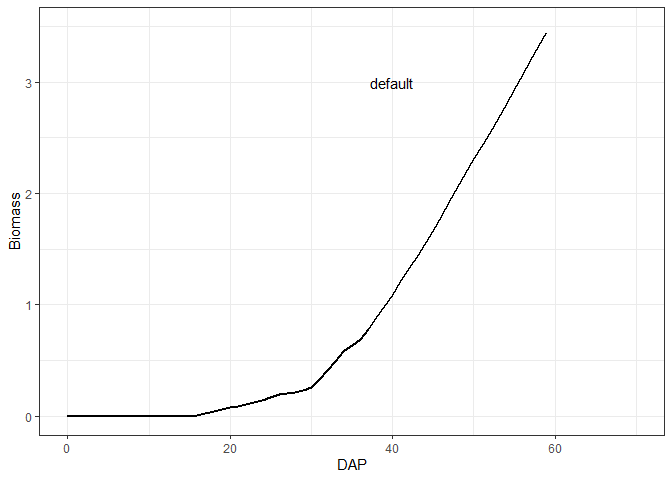
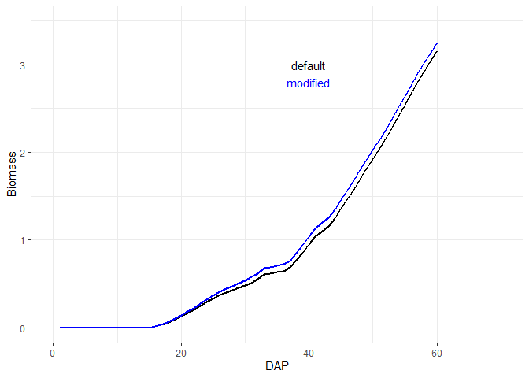

<!-- README.md is generated from README.Rmd. Please edit that file -->

# AquacropOnR

<!-- badges: start -->
<!-- badges: end -->

The goal of AquacropOnR is to make AquaCrop simulations from within `R`
as easy as possible. The package has currently been tested with the
AquaCrop standalone version 7.0 on Windows. The most recent version can
be downloaded from the [FAO
website](https://www.fao.org/aquacrop/software/aquacropplug-inprogramme/en/#c518670).

## Installation and setup

First install [git](https://git-scm.com/downloads). Then you can install
the development version of `AquacropOnR` using the `devtools` package:

``` r
library(devtools)
devtools::install_git(url = "https://gitlab.ilvo.be/plant-modelling/aquacropr.git", force = TRUE)
```

The installation of the AquaCrop standalone version is required.

## Example

This is a basic example to run AquaCrop from `R` for the spinach crop.

Importantly, the working directory should be set to the folder in which
the *aquacrop.exe* file is located.

``` r
library(AquacropOnR)
library(tidyverse)
setwd(dir = path_to_aquacrop_folder)
```

With the package comes an example list with default crop parameters for
**quinoa** and **spinach**. To make this list for your own crop, you
need an AquaCrop cropfile (*YourCrop.CRO*) whose path should be input in
the `read_CRO()` function:

``` r
yourcrop <- read_CRO("path/YourCrop.CRO")` 
```

Once you have the list with default crop parameter values, you can
design the scenario’s for which you want to run AquaCrop. The
`AquacropOnR` package provides a function to design the scenario’s:
`design_scenario()`. The arguments in this function have the following
meaning:

- `name` is a character vector of names for the scenario’s.
- `Plant_Date` is a Date vector that defines the planting date in each
  scenario  
- `IRRI` is a character vector of the names of the irrigation scenario’s
  present in the `ID` column of the `IRRI_s` tibble.  
- `Soil` is a character vector of the names of the soils present in the
  `ID` column of the `SOL_s` tibble.
- `Plu`, `Tnx`, and `ETo` are character (vectors) that refer to the
  names of `R` objects, that hold the daily data for precipitation,
  temperature and reference evapotranspiration, respectively.

**IMPORTANT**:

- The Scenario_s tibble **must** be named `Scenario_s` and **must** have
  the columns (variables) `Scenario`, `Plant_Date`, `IRRI`, `Soil` and
  `Meteo`.  
- The irrigation tibble **must** be named `IRRI_s` and **must** have the
  columns `ID`, `Timing`, `Depth` and `ECw`. Values of the `ID` column
  are given as input to the `IRRI` argument in the `design_scenario()`
  function.  
- The soil tibble **must** be named `SOL_s` and **must** have the
  columns `ID`, `Horizon`, `Thickness`, `SAT`, `FC`, `WP`, `Ksat`,
  `Penetrability` and `Gravel`. Values of the `ID` column are given as
  input to the `Soil` argument in the `design_scenario()` function.  
- The precipitation tibble can be named as you want, but its name is the
  input to the `Plu` argument in the `design_scenario()` function. This
  tibble **must** have the columns `DOY` and `PLU`.  
- The reference evapotranspiration tibble can be named as you want, but
  its name is the input to the `ETo` argument in the `design_scenario()`
  function. This tibble **must** have the columns `DOY` and `ETo`.  
- The temperature tibble can be named as you want, but its name is the
  input to the `Tnx` argument in the `design_scenario()` function. This
  tibble **must** have the columns `DOY`, `TMAX` and `TMIN`.

Examples of these tibbles are available from the package.

``` r
Scenario_s <- design_scenario(name = "S_01", 
                              Plant_Date = as.Date("2019-04-01"), 
                              IRRI = "IRRI_01", 
                              Soil = "Soil_01", 
                              Plu = "Plu_01",
                              Tnx = "Tnx_01",
                              ETo = "ETo_01")
Scenario_s
#> # A tibble: 1 × 7
#>   Scenario Plant_Date IRRI    Soil    Plu    Tnx    ETo   
#>   <chr>    <date>     <chr>   <chr>   <chr>  <chr>  <chr> 
#> 1 S_01     2019-04-01 IRRI_01 Soil_01 Plu_01 Tnx_01 ETo_01
IRRI_s
#> # A tibble: 2 × 4
#>   ID      Timing Depth   ECw
#>   <chr>    <dbl> <dbl> <dbl>
#> 1 IRRI_01     50     0     0
#> 2 IRRI_02     50    25     0
SOL_s
#> # A tibble: 1 × 9
#>   ID      Horizon Thickness   SAT    FC    WP  Ksat Penetrability Gravel
#>   <chr>     <dbl>     <dbl> <dbl> <dbl> <dbl> <dbl>         <dbl>  <dbl>
#> 1 Soil_01       1         4    41    22    10  1200           100      0
Plu_01
#> # A tibble: 365 × 2
#>      DOY   PLU
#>    <dbl> <dbl>
#>  1     1   0.4
#>  2     2   0.7
#>  3     3   0.8
#>  4     4   0.2
#>  5     5   0  
#>  6     6   0.3
#>  7     7   1.9
#>  8     8   6.5
#>  9     9   0.6
#> 10    10   5.2
#> # ℹ 355 more rows
Tnx_01
#> # A tibble: 365 × 3
#>      DOY  TMAX  TMIN
#>    <dbl> <dbl> <dbl>
#>  1     1   9.3   7.2
#>  2     2   7.4   5  
#>  3     3   6.8   2.1
#>  4     4   6.5   2.5
#>  5     5   6.5   2.9
#>  6     6   7.4   4.3
#>  7     7   9.6   4.7
#>  8     8   8.5   6.6
#>  9     9   7.2   3.9
#> 10    10   7.4   1  
#> # ℹ 355 more rows
ETo_01
#> # A tibble: 365 × 2
#>      DOY   ETo
#>    <dbl> <dbl>
#>  1     1 1.03 
#>  2     2 1.17 
#>  3     3 0.743
#>  4     4 0.887
#>  5     5 0.778
#>  6     6 0.695
#>  7     7 0.693
#>  8     8 1.51 
#>  9     9 1.37 
#> 10    10 0.602
#> # ℹ 355 more rows
```

Then it is crucial to create the correct AquaCrop path, while checking
the required folders and choosing which daily outputs to produce.
Therefore the package has the function `path_config()`. Make sure your
path ends with a “/”.

``` r
AQ <- path_config(AquaCrop.path = path_to_aquacrop_folder, Daily_output = c(1,2))
```

Finally, we can run AquaCrop using the `aquacrop_wrapper()` function and
display a plot. The `param_values` argument is used to modify crop
parameters from the default, which is the list provided as input to the
`defaultpar` argument inside the `model_options` list. `situation` takes
a vector of characters, that correspond to the `Scenario` variable in
the `Scenario_s` tibble.

Let us first run the simulation with the default parameters for spinach:

``` r
default <- aquacrop_wrapper(param_values = list(),
               situation = "S_01",
               cycle_length = c("2019-03-15", 70),
               model_options = list(AQ = AQ, defaultpar = Spinach, output = "def"))
ggplot(mapping = aes(x=DAP, y=Biomass)) +
  ylim(0, 3.5) +
  geom_line(data = default, color = 'black', linewidth = 1) +
  geom_text(mapping = aes(x=40, y=3, label = 'default'), color = 'black') +
  xlim(0, 70) +
  theme_bw()
```



And now let’s see what happens when we increase the canopy growth
coefficient `cgc` from 0.15 to 0.18:

``` r
modified <- aquacrop_wrapper(param_values = list(cgc = 0.18),
               situation = "S_01",
               cycle_length = c("2019-03-15", 70),
               model_options = list(AQ = AQ, defaultpar = Spinach, output = "def"))

ggplot(mapping = aes(x=DAP, y=Biomass)) +
  ylim(0, 3.5) +
  geom_line(data = default, color = 'black', linewidth = 1) +
  geom_text(mapping = aes(x=40, y=3, label = 'default'), color = 'black') +
  geom_line(data = modified, color = 'blue', linewidth = 1) +
  geom_text(mapping = aes(x=40, y=2.8, label = 'modified'), color = 'blue') +
  xlim(0, 70) +
  theme_bw()
```



## Example Morris method

For sensitivity analysis using the morris method you first design the
morris sampling scheme and the simulations. Based on these results, you
can then define for wich level you want to calculate the elemntal
effects.

``` r

##p <- aquacrop_morris(situation = "S_01", backgroundpar=Spinach, r = 20, binf=c(rt_max = 0.12, cgc = 0.1), bsup = c(rt_max = 0.55, cgc = 0.21), outvars = c("Biomass", "YSdryS"))

# example on 
```

## Roadmap

- [x] definition of the AquaCrop wrapper function `aquacrop_wrapper`  
- [x] allow option to run AquaCrop on growing degree days instead of
  days  
- [ ] include code for running sensitivity analysis using the morris
  method
